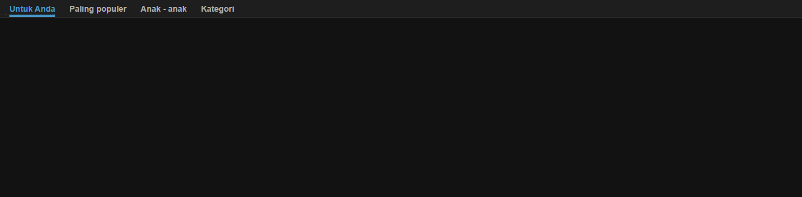

# Navbar Animasi Aktif (Vanilla HTML, CSS, JS)

Proyek ini adalah contoh implementasi **navbar** sederhana dengan efek **indikator garis bawah** yang bergerak mengikuti menu yang aktif.  
Dibuat menggunakan **HTML, CSS, dan JavaScript murni** tanpa library tambahan.

---

## Fitur
- Desain navbar horizontal dengan background gelap.
- Indikator garis bawah bergerak halus ketika menu di-klik.
- Warna teks menu berubah ketika aktif.
- Menyesuakan posisi indikator ketika ukuran layar berubah.

---

---

## Cara Menggunakan
1. Simpan kode `index.html` ke dalam folder proyek.
2. Buka file tersebut menggunakan browser.
3. Klik salah satu menu pada navbar, indikator akan bergerak ke menu tersebut.

---

## Penjelasan Singkat
- **HTML**: Membuat struktur navbar dengan beberapa `<a>` sebagai link menu.
- **CSS**:
  - `.nav-link` untuk style teks menu.
  - `.nav-link.active` untuk menu yang sedang aktif.
  - `.indicator` adalah elemen garis bawah yang bergerak.
- **JavaScript**:
  - Mengatur class `active` pada link yang diklik.
  - Mengubah lebar (`width`) dan posisi (`left`) elemen `.indicator` sesuai posisi menu aktif.
  - Meng-handle perubahan ukuran layar agar indikator tetap berada di posisi yang tepat.

---

## Demo
</img>
<a href="https://kayissun.github.io/navbar-animasi/">Link Demo</a>

---

## Catatan
- Pastikan class `container` di HTML sama dengan di CSS (hindari typo).
- Perhatikan penamaan variabel di JavaScript agar sesuai (`links` bukan `link` tunggal).
- Transisi di CSS gunakan `ease` atau `linear` untuk hasil yang mulus.

---

